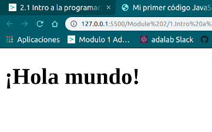
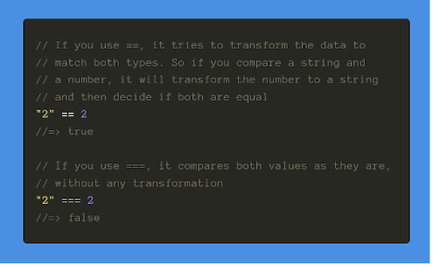
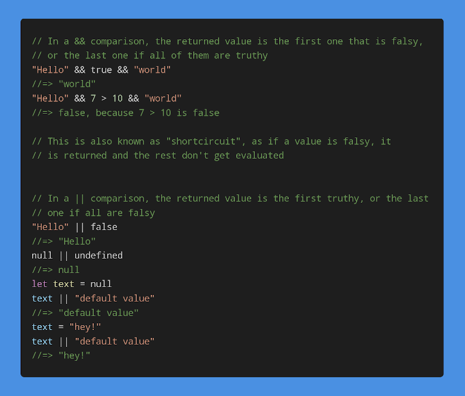

# 1. Intro a la programación

## Example "Hola mundo"

```html
<!DOCTYPE html>
<html lang="es">

<head>
    <meta charset="utf-8">
    <title>Mi primer código JavaScript</title>
</head>

<body>
    <h1></h1>
    <!-- De momento, colocaremos la etiqueta script justo antes de cerrar la etiqueta body -->
    <script type="text/javascript" src="main.js"></script>
    <!-- src, where js is -->
</body>

</html>
```

```js
'use strict';

document.querySelector('h1').innerHTML = '¡Hola mundo!';
```

Result:




```js
'use strict'; 
//faster & more efective. not show errors. 
//Always 1st line

document.querySelector('h1').innerHTML = '¡Hola mundo!';
// a statement-> minimal unit
// which describes an action
// this statement changes h1
```
We use (;) between actions. 1 action/line 

```js
'use strict';document.querySelector('h1').innerHTML='¡Hola mundo!';
```

## Variables
To save an action to use later.
1. Create a box with a label.
2. Info inside the box.
3. Use label to obtaine the info.

### 1. Create a variable
```js
let officeAddress;
```
Important:
* english, only 1 word
* 1st= letter
* use  [camel case](https://es.wikipedia.org/wiki/Camel_case)

Ex:**'myCoolVariableName'**

### 2. Info inside the box.

```js 
//variable=value
let officeAddress;
officeAddress = 'Calle Leganitos, 24';
```
```js
//variable=action
let totalHours;
totalHours = 10 + 20 + 30;
```
You can use only 1 line:
```js
let officeAddress = 'Calle Leganitos, 24';
```
You can change the value of the variable:
```js
let officeAddress;
officeAddress = 'Calle Leganitos, 24';
officeAddress = 'Calle Mayor, 7';
officeAddress = 'Calle Embajadores, 7';
```

### 3. Use label to obtaine the info.
```js
let earnings = 12020;
let expenses = 5342;
let benefits = earnings - expenses;
```
Variable changes-> final value 

##Contants

```js
const officeAddress = 'Calle Leganitos, 24';
```
When do we use const or let?
It's better to use always **const** , and change to let when we need it.


```js
const headerHeight = 72;
const subHeaderHeight = 24;
const screenHeight = 620;
const remainingSpace = screenHeight - headerHeight - subHeaderHeight;
const sections = 4;
const sectionSize = remainingSpace / sections;
```
We need this syntaxis to understand what those numbers mean. Our code will be read by other people.

We use **classList** to add or remove a class or to check if an element has a class or not.

* add
* remove


```js
sectionB.classList.add('hidden', 'otraClase', 'otraMas');
// Así hasta aburrirnos
```

## Bonus getElementById
```js
const mainTitle = document.querySelector('#mainTitle');

or 

const mainTitle = document.getElementById('mainTitle');
```
With gelElementById you don't need to put #.


## Bonus var
```js
var pageBgColor;
pageBgColor = '#3d7e9a';

for constant values

var DAYS_PER_WEEK = 7;

```

 apuntes clase


eslint. nos avisa si hay algun error
phplint
es=js

addevenlistener: un avisador está pendiente
focus, blur (cuando se sale de estar seleccionado), cuando cambia de tamaño
keyup

debugger

dime cuando han pasado 3 minutos


```js
cons ...sum


numberBvalue= parseInt()
const numberA =document.querySelector (".numberA");

numberA.addEventListener ("change", sum);
```


# 2. Intro a la programación 2

```js
console.log('Hola');

const age = 56;
console.log(age);
```

loguear información:
* to resolve errors
* to check the chain of operations

## Tipos de datos
1. String of characters. To represent text
2. Number
3. Undefined. A value without definition


### Number
* Integers (números enteros). Ex: 14232, -42
* Floating point numbers/ float (números decimales). Ex: 1.32

### Addition, subtraction, multiplication and division
+, -, /, *

1. Operation between parentheses
2. Multiplication & division
3. Addition & subtraction

### Spring
It's a chain of characters.
We can use  ('') and ("").
**('') can include -> ("")**
There are some erros possible using " " & ''. 
* to use ' ' when we have "" inside
* to write \ like 'I\'m a front-end developer'

### Concatenar cadenas
We use ( + ) to add 2 or more texts.
```js
"Fecha de conexión: " + "jueves 15"  // Devuelve "Fecha de conexión: jueves 15"
'H' + 'o' + 'l' + 'a'                // Devuelve "Hola"
"Faltan " + "3" + " días"            // Devuelve "Faltan 3 días"
```

### Template strings (interpolación)
Facilitate variables & operations of springs
```js
const name = 'Ada';
const surname = 'Lovelace';

console.log(`My name is ${name} ${surname}.`);
// 'My name is Ada Lovelace.'

or

const firstItemPrice = 5;
const secondItemPrice = 3;

console.log(`Total amount: ${firstItemPrice + secondItemPrice}€`);
// Total amount: 8€

// or in more than 2 lines:

const element = document.querySelector('#element');
const textToShow = 'Hey, this is important.';

// ES5
element.innerHTML = '\
<div class="popup">\
  <span>' + textToShow + '</span>\
</div>';

// ES6
element.innerHTML = `
<div class="popup">
  <span>${textToShow}</span>
</div>`;

```
### String's length

```js
const browserName = 'Mozilla';

console.log('Mozilla is ' + browserName.length + ' code units long');
```

### Undefined
```js
let notDefinedVar;

console.log(notDefinedVar); // undefined
```

### Changing strings to numbers

With parseInt() we can change a string to a number.

```js
const userAge = document.querySelector('.user__age');
const yearsToRetirement = 67 - parseInt(userAge.innerHTML);

console.log(`Te quedan ${yearsToRetirement} años para jubilarte`);s
```

### Type of 
To know what kind of variable is it.
```js
const text = '¿De qué tipo soy?'
console.log('Soy de tipo:', typeof(text)) // con paréntesis
console.log('Soy de tipo:', typeof text) // sin paréntesis
```


### NaN
Not a number
isNaN show us if the variable is NaN or not.

```js
let userAge = document.querySelector('.user__age');
userAge = parseInt(userAge);
console.log('La usuaria no ha introducido una edad válida:', isNaN(userAge));
```

# 3. Conditionals

## Booleans

We use them to keep true or false data or to become comparations to true or false info.

Ex. 
```js
const filled = false; // Este booleano es falso
const solved = true; // Este booleano es verdadero
```

### Truthy & Falsy


| The values of falsy are: |
|--------|
| false | 
| null |
| undefined |
| 0 |
| NaN |
| '' |
| "" |

### Equality

=== strict equal
==  only compares the value (not the type of data)
we can't use  ==




### Inequality

!== strict not equal 
check if 2 values are different (value & type)


```js
const currentVegetable = 'lettuce';
const isLettuce = currentVegetable === 'lettuce'; // true
const isTomato = currentVegetable === 'tomato'; // false
---
const result = 5;
result !== 4 + 5; // true
result !== 0 + 5; // false

```

* < (less than)
* > (greater than) 
* <= (less than or equal) 
* >= (greater than or equal)

```js
const result = 5;

result >= 4 + 5; // false
result >= 0 + 5; // true
result >= 4 - 5; // true
```

### Logical operators



with booleans, 

# Negation
! NOT
```js
const emptyNameField = true; // true
const nameIsFilled = !emptyNameField; // false
---

const nameField = document.querySelector('.input-name').value; // Accedemos al valor de un input que está en la página, y está vacío (falsy)
const emptyNameField = !nameField; // true
const nameIsFilled = !emptyNameField; // false
```

Also we can use !! to use negation twice.

```js
const nameField = document.querySelector('.input-name').value; // '' (falsy)
const nameIsFilled = !!nameField; // false
```

# AND
expression1 && expression2

```js
const name = 'María';
const age = 35;

name === 'María' && age >= 30; // true
name === 'Marta' && age >= 30; // false
name === 'María' && age >= 40; // false
name === 'Marta' && age >= 40; // false

---
const isModerator = true;
const isAdmin = false;
const userName = 'Layla';

// Como la primera expresión es `truthy`, se devuelve la segunda expresión
const moderatorName = isModerator && userName; // Layla

// Como la primera expresión es `falsy`, se devuelve esta, y la segunda ni siquiera llega a evaluarse.
const adminName = isAdmin && userName; // false

```
only the result will be true if both expressions are truthy

# OR
expression1 || expression2

Almost one of the expressions must be truthy--> true
If both are falsy--> false

```js
const name = 'María';
const age = 35;

name === 'María' || age >= 30; // true
name === 'Marta' || age >= 30; // true
name === 'María' || age >= 40; // true
name === 'Marta' || age >= 40; // false

---

const welcomeMessageElement = document.querySelector('.welcome__text');

const isAdmin = false;
const adminText = isAdmin && 'administradora';
const isModerator = true;
const moderatorText = isModerator && 'moderadora';

// Como la primera expresión es `falsy`, se devuelve la segunda expresión
welcomeMessageElement.innerHTML = `Bienvenida ${adminText ||
  moderatorText}. ¡Es genial verte de nuevo!`;
  
```
